# Инструкция по работе с Git и Visual Studio Code
---
## 1.Базовые настройки
Для выполнения работы необходимо установить Visual Studio Code и Git
### 1.1 Работа с локальным репозиторием
Для создания репозитория необходимо:
1) Создать папку в удобном для вас месте

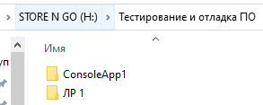

2) В VS Code при помощи комбинации клавиш Ctrl k, Ctrl o добавляем нужную папку в проект

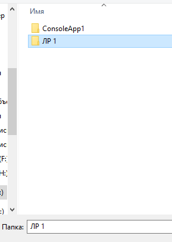

При помощи комбинации клавиш Ctrl Shift ё открываем терминал и в правом углу данного окна назначем Git Bash терминалом по умолчанию.

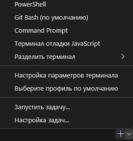

### 1.2 Инициализация пользователя
В терминале прописываем следующие команды для инициализации пользователя:
* git config --global user.name "Имя пользователя" - задаем имя пользователя в системе для привязки коммитов
* git config --global user.email "Почтовый адрес пользователя" - задаем почтовый адрес пользователя в системе для привязки коммитов

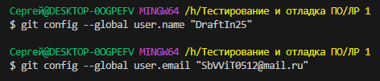

## 2.Инициализация репозитория
* git init -команда инициализация репозитория. При инициализации создается скрытая папка, в которой находятся все объекты, необходимые для истории работы над проектом.

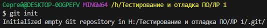

* git status - просмотр статуса репозитория. Можно узнать, какие файлы участвуют в нашем проекте.

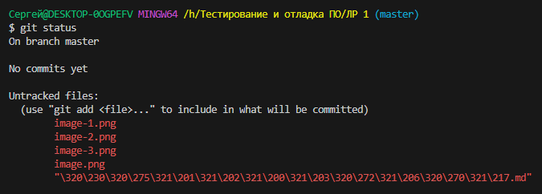

* git add . -команда добавления всех файлов и папок в нужную область (в папку, которую мы создавали изначально).
Также можно добавить конкретный файл командой git add < filename >

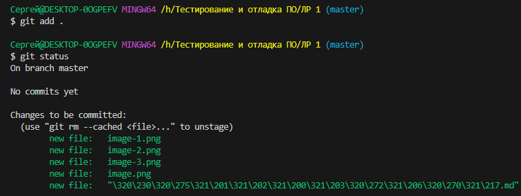

## 3. Работа с коммитами
Коммит- это запись индексированных изменений в репозиторий Git. Коммит хранит текущее состояние индексированных файлов, а также последние сохраненные состояния неиндексируемых (неотслеживаемых) файлов.
* git commit -m "Commit Name" - создаем коммит. Флаг -m означает, что мы хотим дать название коммиту. 

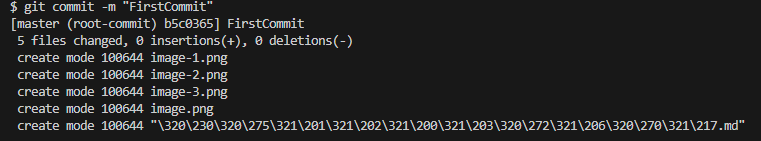

* git log - команда позволяет посмотреть текущие коммиты и их состояние. Введя флаг -p после git log, можно изучить детальное изменение каждого файла.

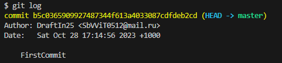

Некоторые из основных команд при работе с коммитами:
* git diff - показывает разницу между двумя Git-деревьями (или коммитами) 
* git log --stat -показывает сокращенную статистику для каждого коммита
* git log --graph - отображает граф с ветвлениями и историей слияния
* git commit -a -m "Commit Name" - автоматически записывает изменения в репозиторий и добавляет все измененные файлы .
* git commit --ammend -m "Commit Name" - записывает изменения последнего коммита.
## 4. Удаленный репозиторий
Для создания удаленного репозитория необходимо сделать следующие действия:
1) Заходим на сайт GitHub (https://github.com) и регистриуремся.

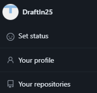

2) Создаем репозиторий

3) После создания репозитория откроется окно, в котором будут указаны команды для связывания между собой удаленного и локального репозитория

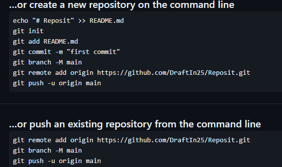

* git remote add origin <ссылка на репозиторий> - добавляем удаленный репозиторий 
* git branch -M main - указываем название основной ветки в репозитории .
*git push -u origin main - устанавливаем связь между веткой, в которой мы находимся и веткой main на удаленном сервере.